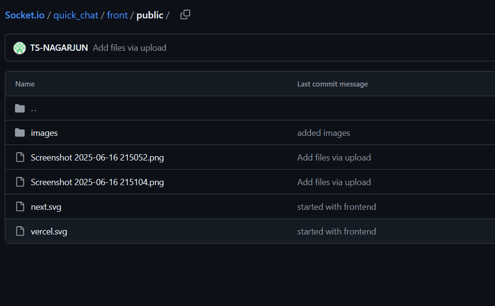

# Quick Chat 💬

Quick Chat is a full-stack messaging application featuring real-time communication and basic media sharing.

---

## 🖼️ Screenshots

These images are part of the frontend UI and are served from `front/public/`.

### 📸 SCR1

### 📸 SCR2

> ⚠️ Make sure you start the frontend dev server (`npm run dev` in `front/`) to see the images at `http://localhost:3000/SCR1.png` and `http://localhost:3000/SCR2.png`.

---

## 📁 Project Structure

