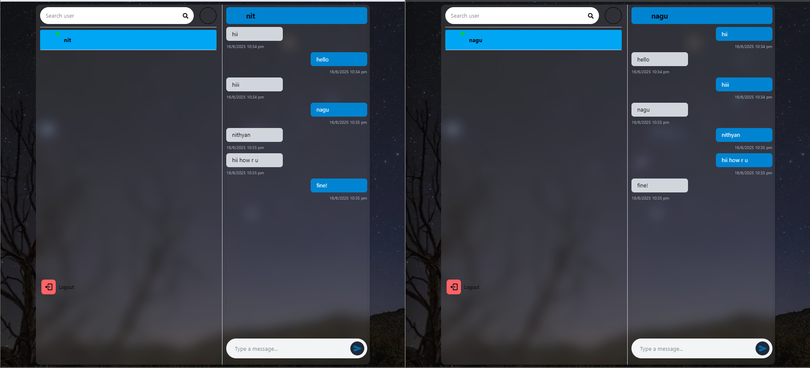

# Quick Chat 💬

Quick Chat is a full-stack messaging application featuring real-time communication and basic media sharing.

---

## 🖼️ Screenshots

### 📸 SCR1

> ⚠️ Make sure you start the frontend dev server (`npm run dev` in `front/`) to see the images at `http://localhost:3000/SCR1.png` and `http://localhost:3000/SCR2.png`.

---

## 📁 Project Structure

quick_chat/
├── front/ # Frontend (Next.js or React app)
│ ├── public/ # Static assets served to the client
│ │ ├── SCR1.png
│ │ └── SCR2.png
│ └── ... # Frontend source code
├── server/ # Backend server (e.g., Node.js, Express)
└── README.md # Project overview (this file)
